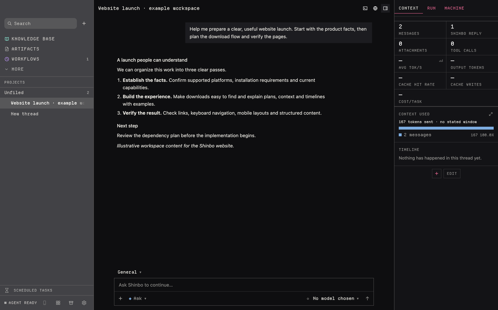
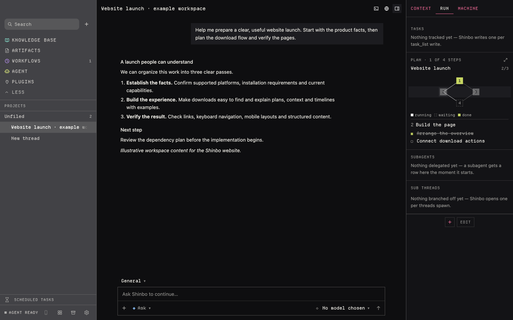
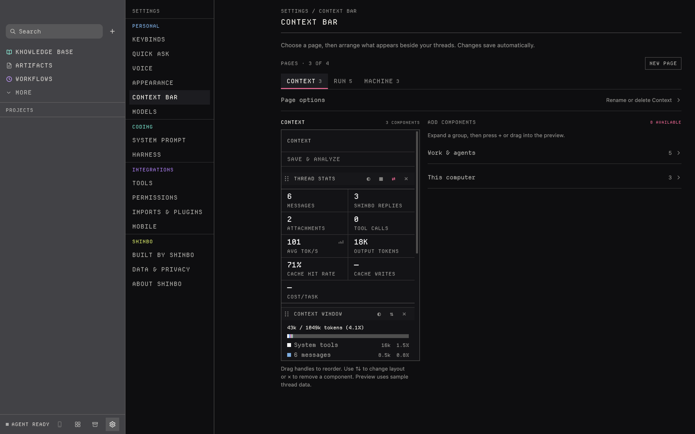
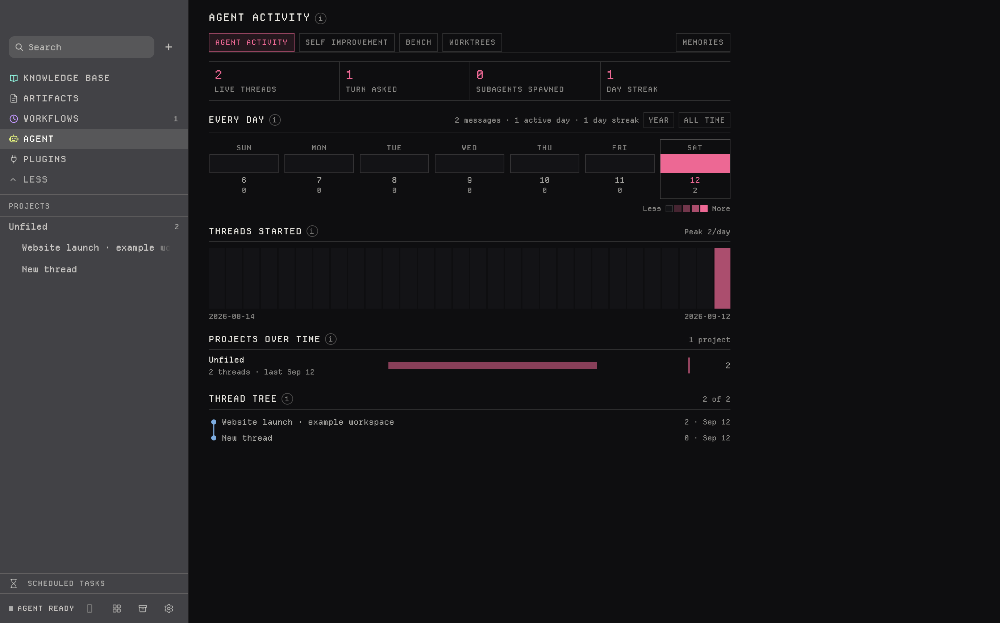
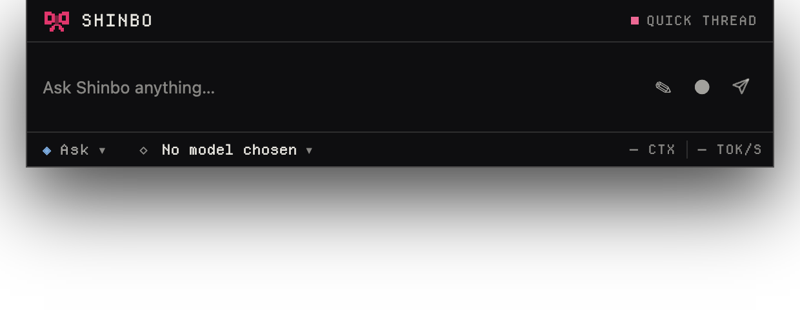
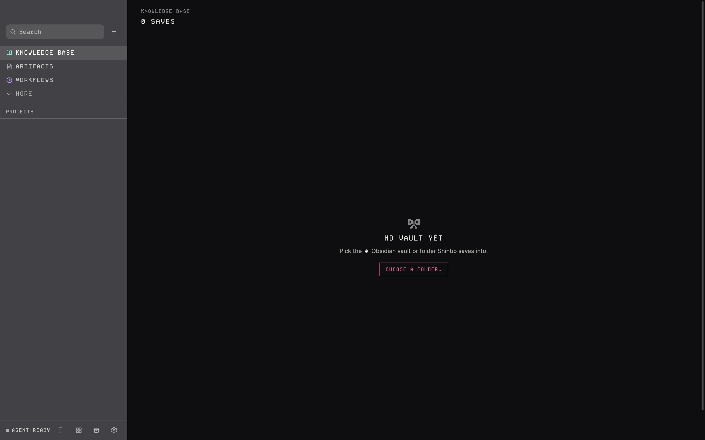
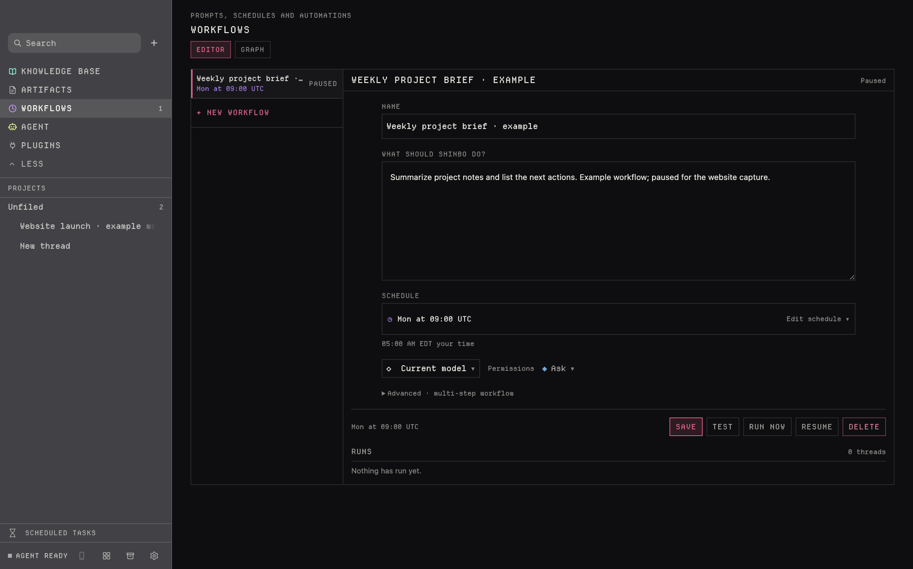
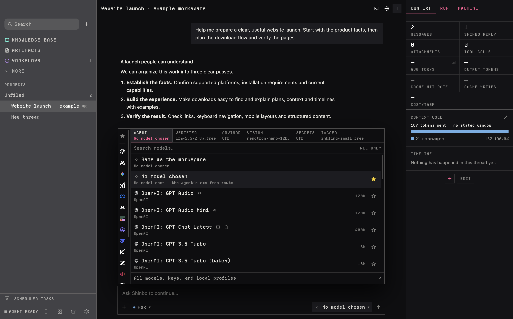

<div align="center">


# Emma

**A self-learning, self-building metaharness.**

It runs its own agent loop, drives the coding CLIs you already have, writes parts of its own interface, and benches its own changes before keeping them.

[](#requirements)
[](desktop/package.json)
[](rust-toolchain.toml)
[](harness/build.zig.zon)
[](desktop/package.json)
[](docs/README.md)



</div>

---

- **One loop, every surface.** Composer, Quick Ask, quick actions, scheduled jobs — all enter the same interception in Electron main.
- **A coding agent with the usual verbs.** Files, grep, shell, browser, screen, MCP tools, skills installed mid-turn, work fanned out to subagents.
- **It drives the CLI you already use.** Claude Code, Codex, Pi, OpenCode, and Cursor run as workers in your working tree.
- **Every turn is instrumented.** A span tree per run — model requests, tool calls, wall clock, token deltas — appended to the thread's Markdown.
- **Plain Markdown records.** Threads, task lists, and plans stay on disk; kept notes go into the vault folder you picked.

## Quickstart

Published macOS and Windows builds are distributed through [GitHub Releases](https://github.com/tronschell/emma/releases).
On macOS, open `Emma-vX.Y.Z-darwin-arm64.dmg` and drag `Emma.app` onto
Applications. On Windows 10 version 1809 or later on x64, run
`Emma-vX.Y.Z-win32-x64-Setup.exe`; it installs per user and needs no
administrator prompt. Windows builds are not code signed yet, so SmartScreen
warns once — click **More info**, then **Run anyway**. Both platforms
auto-update from the published release. Windows ARM64 packages from source but
is not a published target. The toolchains below are only needed to build from
source:

```bash
git clone https://github.com/tronschell/emma.git
cd emma
npm install --prefix desktop
npm run dev
```

On macOS, double-tap the physical **left Option** key to open Quick Ask; on
Windows, double-tap the physical **left Alt** key. Windows uses **Ctrl** where
macOS uses **Command** in shortcut labels. Pick a model in **Settings → Models**:
any OpenAI-compatible endpoint, including a local one (Ollama, LM Studio,
llama.cpp) for local inference. Optional tools and secondary models have their
own routes; choosing a local chat model is not an app-wide offline switch. For
hosted, `export OPENROUTER_API_KEY=…` or paste a key in Settings.

### Requirements

| | |
|---|---|
| **OS** | macOS 12 or later on Apple silicon, or Windows 10 version 1809 or later on x64; ARM64 builds from source but is not published |
| **Node** | 24+ |
| **Rust** | 1.97.1 (`rust-toolchain.toml` pins it) |
| **Zig** | 0.16.0 |
| **Xcode** | macOS only: `clang` builds native helpers; packaging also needs full Xcode's `actool` |
| **Windows toolchain** | Windows only: LLVM `clang`/`clang++` and Windows SDK import libraries build native helpers; CI packages and publishes the x64 Squirrel installer |

New to the repo? **[docs/getting-started.md](docs/getting-started.md)**

## Plans and subagents



`plan` breaks a job into steps, runs the independent ones as parallel subagents, and keeps the whole graph as one Markdown file it edits as it goes. A step it can't finish stays red and holds everything downstream. → **[docs/concepts.md](docs/concepts.md)**

## Permissions

| Mode | | What it means |
|---|---|---|
| `ask` | ◈ | File writes and commands ask first; app access asks once per turn. **Default.** |
| `acceptEdits` | ◆ | File edits go through; commands and app access still ask. |
| `auto` | ⬗ | A verifier reads gated calls; anything it won't clear still asks you. App access always asks you. |
| `full` | ⬥ | Tools run automatically; app access still asks. Escape stops a computer run. |

One table in [`desktop/shared/permissions.ts`](desktop/shared/permissions.ts) decides what each mode advertises *and* what it gates, so the label and the check can't drift. Subagents inherit the mode. → **[docs/permissions.md](docs/permissions.md)** · **[docs/tools.md](docs/tools.md)**

## The context bar



Ten components you arrange across up to four pages: thread stats, the context-window ledger, the turn timeline, the plan graph, subagents, sub-threads, Git, and three readings of one machine sampler. One `Ledger` object feeds them all, so no two readings can disagree. → **[docs/context-bar.md](docs/context-bar.md)**

## Self-improvement



The Agent page mines its own traces for repeat failures, drafts one change to the standing instructions or the verifier rules, A/Bs it live, and keeps it only if a replay bench clears both a paired t-test and a sign test. **Revert** never needs evidence. → **[docs/agents.md](docs/agents.md)**

## The notch surfaces




On macOS, Quick Ask wraps the real camera housing, measured per display; screens
without one get a calibrated virtual notch. On Windows it appears as a small
pill near the top of the display. Three quick actions use `Command-1/2/3` on
macOS and `Ctrl-1/2/3` on Windows, plus a radial ring at the cursor. Either
surface can be switched off. → **[docs/notch.md](docs/notch.md)**

## Knowledge base



Point `keep` at an Obsidian vault or any plain folder: one Markdown note per save, attachments alongside, YAML front matter, titled and tagged by a small model. No mirror, no second copy. → **[docs/knowledge.md](docs/knowledge.md)**

## Jobs



A job is one validated trigger (cron, `manual`, `after <job-id>`, or an app event) plus a graph of `agent` / `set` / `if` nodes. → **[docs/jobs.md](docs/jobs.md)**

## Models



Any OpenAI-compatible local or hosted endpoint. Keys are encrypted with the OS secure credential store and reach the harness through its spawn environment. **Private routing** requests no-training, zero-retention OpenRouter endpoints for the main agent loop and fails when none qualify. It does not cover secondary models, tools, or your provider account's logging settings. → **[docs/models.md](docs/models.md)** · **[docs/privacy.md](docs/privacy.md)**

## In a terminal

```bash
/Applications/Emma.app/Contents/Resources/emma-cli ask "explain this repository"
```

On Windows, run `resources/emma-cli.exe` from the installed app directory.

The same agent, headless. Bare `emma-cli` is a REPL in the current directory; `sessions`, `tasks`, and `permissions` are its other subcommands, gated on the tty under the same modes.

## Architecture

```text
     sandboxed React renderer
             │  allowlisted IPC
     Electron main / preload
             ├─ newline-delimited JSON over stdio
             │      Rust host ──► emma-core ──► Markdown stores
             └─ Agent Client Protocol over stdio
                    Zig harness ──► OpenAI-compatible providers and MCP tools
```

```text
desktop/        Electron main/preload and React 19 workspace
crates/core/    Markdown thread and scheduled records
crates/host/    NDJSON host bridge
harness/        emma-cli, Emma's fork of vercel-labs/fx, Apache-2.0
docs/           Product and architecture contracts
```

[`harness/`](harness) is a fork of [vercel-labs/fx](https://github.com/vercel-labs/fx), driven over the [Agent Client Protocol](https://github.com/zed-industries/agent-client-protocol). It owns the agent loop, tools, hooks, skills, subagents, and the MCP client. Every turn runs on it — there is no second loop. → **[docs/architecture.md](docs/architecture.md)** · **[docs/harness.md](docs/harness.md)**

## Development

```bash
npm --prefix desktop run check
cargo fmt --all -- --check
cargo check --workspace --locked --all-targets
cargo test --workspace --locked
cargo clippy --workspace --locked --all-targets -- -D warnings
(cd harness && zig build test)
```

[`AGENTS.md`](AGENTS.md) is the source of truth for anyone — human or agent — changing this repo. `just check`, `just test`, and `just package` wrap the rest; `npm run package:mac` builds macOS and `npm run package:win` builds the current native Windows x64 or ARM64 target.

Release flow: feature branches → `dev` → `main`. PR titles and release summaries
feed the automatic changelog; the root `package.json` sets the version. Promoting
a prepared release to `main` checks and packages both platforms, signs,
notarizes and staples macOS, and publishes one release carrying the macOS disk
image and zip and the Windows x64 Squirrel installer, package, and `RELEASES`
feed. Windows publishes unsigned until a code signing certificate is added.
→ **[Release guide](docs/releases.md)** · **[Development](docs/development.md)**

## Docs

Everything lives in **[`docs/`](docs/README.md)** — [getting started](docs/getting-started.md), [concepts](docs/concepts.md), [architecture](docs/architecture.md), [permissions](docs/permissions.md), [tools](docs/tools.md), [models](docs/models.md), [privacy](docs/privacy.md), [context bar](docs/context-bar.md), [components](docs/components.md), [knowledge](docs/knowledge.md), [notch](docs/notch.md), [voice](docs/voice.md), [terminal](docs/terminal.md), [jobs](docs/jobs.md), [computer use](docs/computer-use.md), [goals](docs/goals.md), [agents](docs/agents.md), [browser](docs/browser.md), [mobile](docs/mobile.md), [CLI](docs/cli.md), [harness](docs/harness.md), [plugins](docs/plugins.md), [design system](docs/design-system.md), [development](docs/development.md), [data](docs/data.md), [credits](docs/credits.md), [troubleshooting](docs/troubleshooting.md).

## Credits

Forked from [vercel-labs/fx](https://github.com/vercel-labs/fx) (Apache-2.0, © Vercel, Inc. and fx contributors) at `580a0c5`. Built on Electron, React, TypeScript, Vite, Tailwind, xterm.js, serde, [ripgrep](https://github.com/BurntSushi/ripgrep), [Departure Mono](https://departuremono.com), and more. Every dependency and its license: **[docs/credits.md](docs/credits.md)**.

## License

MIT — see [`LICENSE`](LICENSE). Subtrees with their own terms:

| | |
|---|---|
| `harness/` | Apache-2.0 — [`harness/LICENSE`](harness/LICENSE), [`harness/FORK.md`](harness/FORK.md) |
| `crates/` | Declares `Apache-2.0` in [`Cargo.toml`](Cargo.toml) |
| Departure Mono | SIL Open Font License — [`desktop/assets/DepartureMono-LICENSE.txt`](desktop/assets/DepartureMono-LICENSE.txt) |
| Brand assets | Per [`docs/icon-sources.md`](docs/icon-sources.md) |
